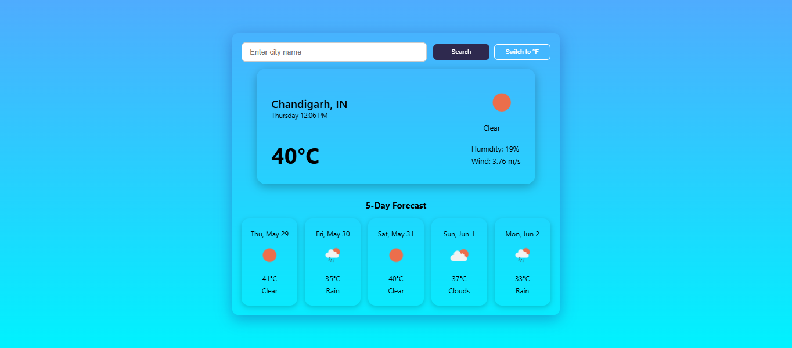

# 🌤️ Weather App

A responsive weather application built using **React** and **CSS Modules**. It fetches real-time weather and forecast data using the **OpenWeatherMap API** and displays it with a dynamic background that changes based on the weather and time of day.


---

## 📷 Preview



---

## 🔗 Live Link

[weather-dashboard-five-alpha.vercel.app](weather-dashboard-five-alpha.vercel.app)

---


## 🚀 Features

- 🔍 Search for weather by city name  
- 🌡️ Current weather and 5-day forecast  
- 🎨 Dynamic gradient background based on:
  - Weather condition (e.g., Clear, Clouds, Rain, Snow)  
  - Time of day (Day or Night)  
- 🔁 Auto-refresh every 30 seconds
- ⚙️ Unit toggle (Metric / Imperial)  
- ❗ Error handling for invalid city names  

---


## 🛠️ Tech Stack

- **React**
- **CSS Modules**
- **OpenWeatherMap API**
- **LocalStorage** (to save the last searched city)

---


## 📦 Installation

### 1. Clone the repository

```bash
git clone https://github.com/aayush-sharma001/weather-dashboard.git
cd weather-dashboard
```

### 2. Install dependencies

```bash
npm install
```

### 3. Add your OpenWeatherMap API key

Create a `.env` file in the root of the project and add your API key:

```
VITE_OPENWEATHER_API_KEY=your_api_key_here
```

You can get a free API key by signing up at [https://openweathermap.org/api](https://openweathermap.org/api)

### 4. Run the application

```bash
npm run dev
```

The app will start on `http://localhost:5173`.
